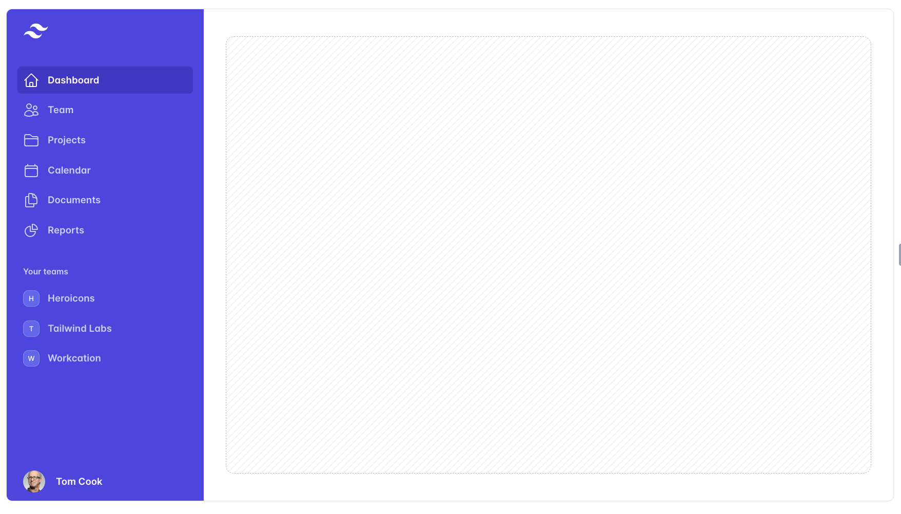
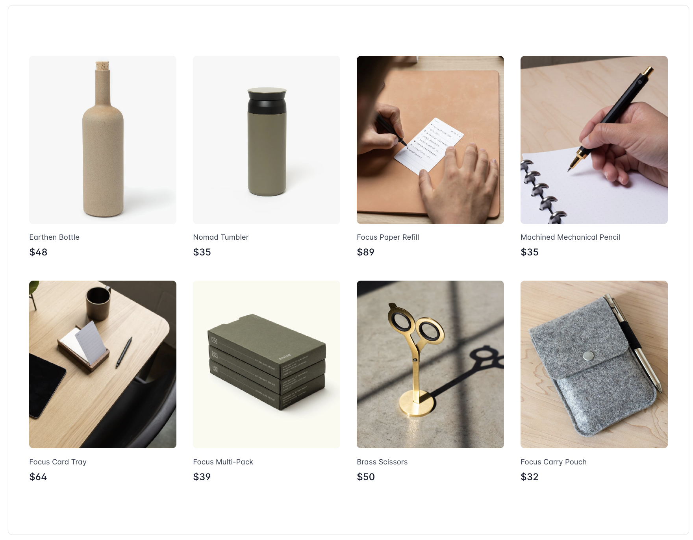
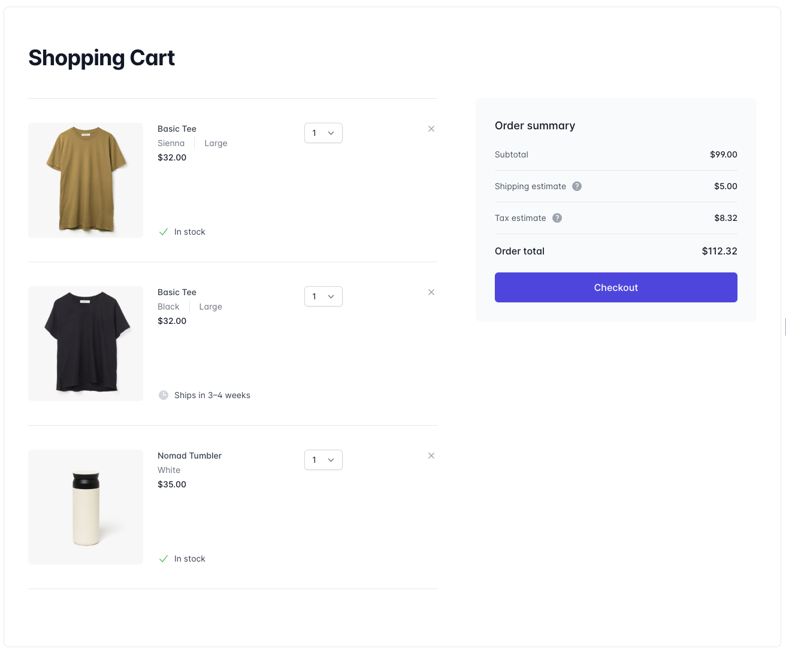

<h1><u>"Ruke's Emporium"</u></h1>

An e-commerce website dedicated to pet (specifically dog) products. 

<h4>SCREENSHOTS:</h4>
In progress...

<h4>TECHNOLOGY USED:</h4>

* MERN (MongoDB, Express, React, Node)
* CSS (third-party components from tailwind css)

<h4>PROJECT LINKS</h4>

* 'Ruke's Emporium' (in progress..)
*  <a href="https://trello.com/b/srZW5XYY/p3-planning">Project Trello Board</a>
* Wireframe (design layout chosen, examples below)

<h4>NEXT STEPS (icebox features):</h4>

* Add user auth (OAUTH2)
* Build out additional categories of products (total of seven in planning)
* Implement payment API (Paypal or Square)
* Implement user reviews of products
* Implement account details: order history, user reviews
* Build parent category of 'animals' allowing more products for business expansion (dog only with initial build)