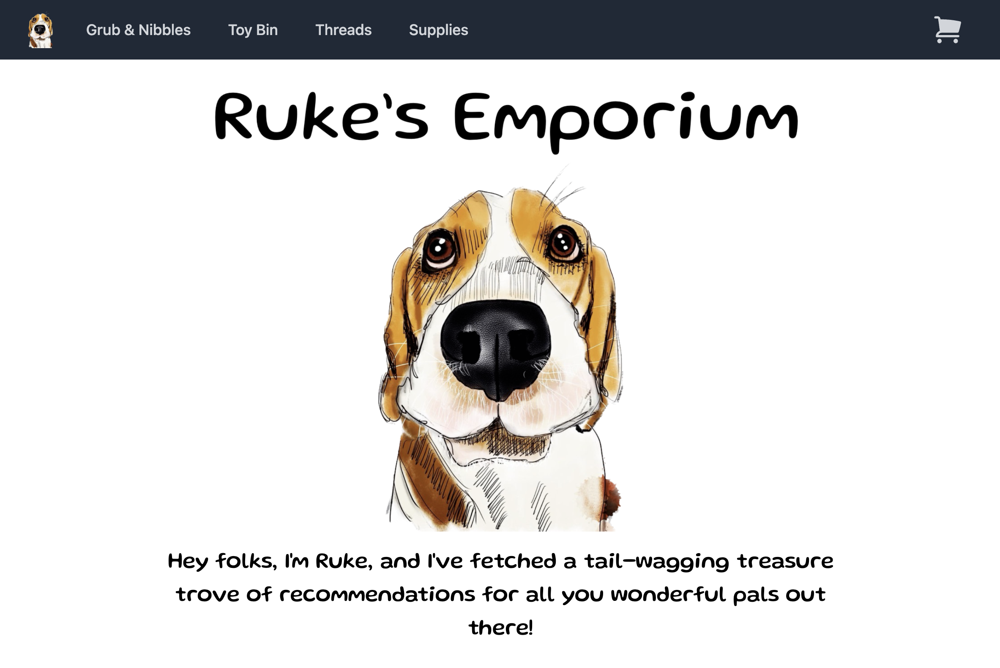
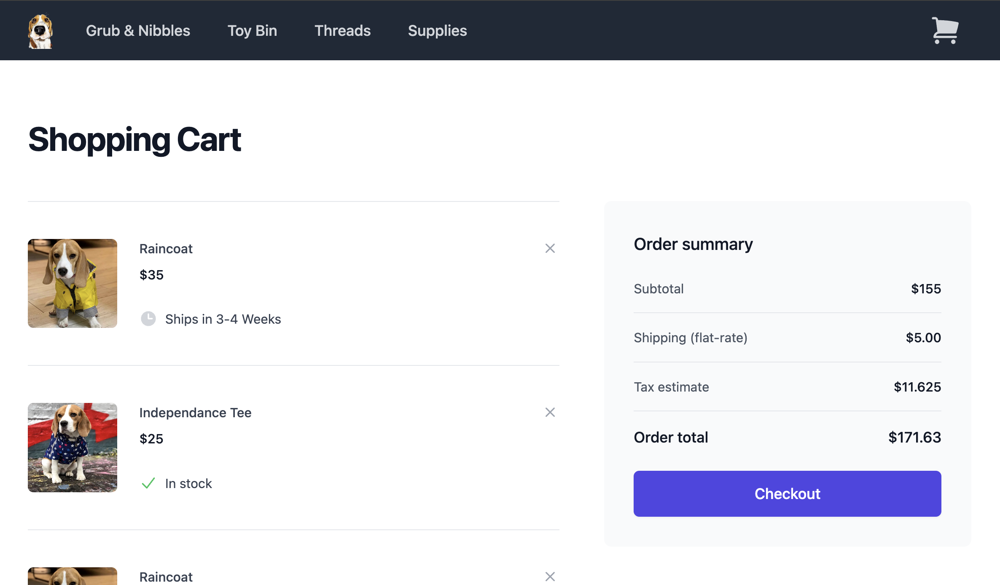

## Ruke's Emporium

An e-commerce website dedicated to pet (specifically dog) products. 

##### SCREENSHOTS:

##### TECHNOLOGY USED:</h4>

* MERN (MongoDB, Express, React, Node)
* CSS (third-party components from <a href ="https://tailwindcss.com/">Tailwind CSS</a>)

##### PROJECT LINKS

* <a href="rukes-emporium.netlify.com">Ruke's Emporium</a>
*  <a href="https://trello.com/b/srZW5XYY/p3-planning">Project Trello Board</a>

##### Planned Future Application Updates:

* Implement quantity feature -> increment/decrement quantity in cart
* Add user auth (OAUTH2)
* Implement payment API (Paypal or Square)
* Implement user reviews of products
* Implement a search function to quickly find products
* Implement account details: order history, user reviews
* Build parent category of 'animals' allowing more products for business expansion (dog only with initial build)