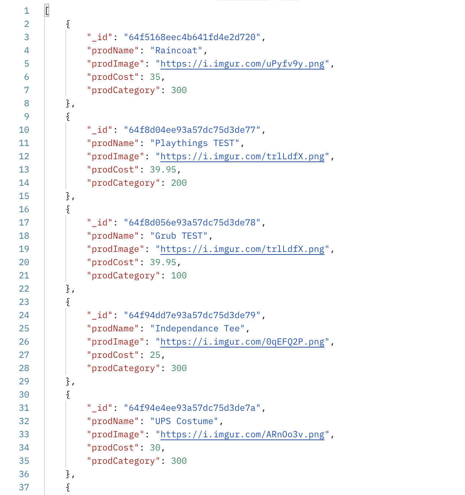

<h2><u>P3 Planning:</u></h2>
<h4>Ruke's Emporium <i>(an e-commerce site)</i></h4>

* Home page: welcome screen, branding/logo
    * Nav bar with categories as links to product pages
    * User login authentication - Google OAuth API

* Product pages
    * minimum three categories built for MVP (with seven total in planning)
    * minimum six products per category for MVP

* Shopping cart
    

<h4><u>FE Component Tree:</u></h4>

<h4><u>DATABASE Structure:</u></h4>

>

<h4><u>USER STORIES</u></h4>

* As a user, I want a user friendly site that carries food, treats and toys for my dog. (MVP)
* As a user, I want to see items categorized by type of product. (MVP)
* As a user, I want be able to add/remove items from my shopping cart as I find them. (MVP)
* As a user, I want to find a new favorite site that I can access both on my desktop, and mobile device with no content layout issues. (MVP) 
* As a user, I want to be able to search for my favorite product on the store's site. (IB)
* As a user, I want to have a personal account to keep track of personal information so that I do not have to enter it every time. (IB)
* As a user, I want to see item reviews from other users who have purchased the item previously. (IB)
* As a user, I want to have a secure method of payment through a trusted service, such as PayPal or Stripe. (IB2)
* As a user, I want my shopping cart to be saved when I leave the site (if I was logged in to my account) (IB2)

<h4><u>MODELS:</u></h4>

* product:
    * name (string)
    * category (string)
    * image (string)
    * cost (number)

* cart:
    * item
    * qty

<h5><u>ICEBOX MODELS</u></h5>

* product
    * individual pages with item description/information

* user
    * user id
    * contact information (address, email, phone)
    * order history (order id, order contents)

* product reviews
    * user reviews of product

* payment:
    * payment type
    * payment API - Paypal
    * user id (ref user model)
    * order (ref order model)
    * order number (id)
    * order timestamp

<h4>Known Issues</h4>
* Items add to cart as separate items when they are the same product (quantity feature not implemented yet)
* If two of the same items are in cart, when removing one both will be removed as they are being removed from localStorage by ID (will implement a increment/decrement quantity feature)
